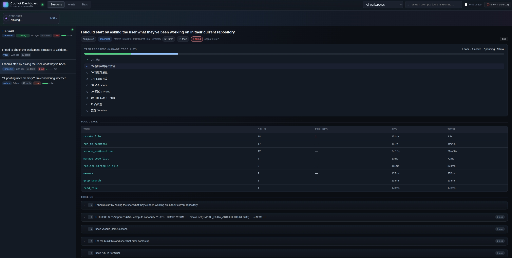
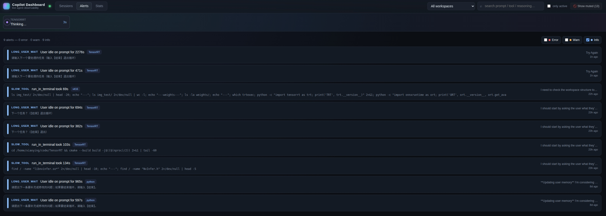
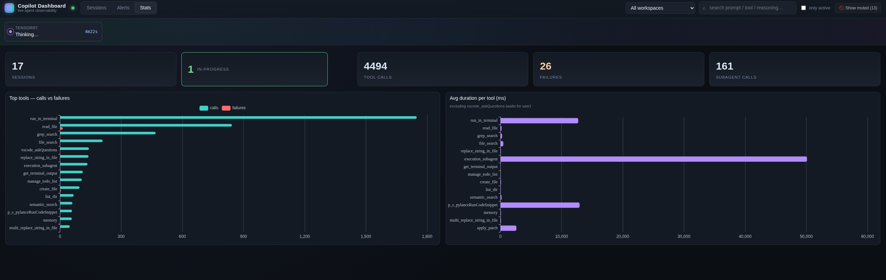
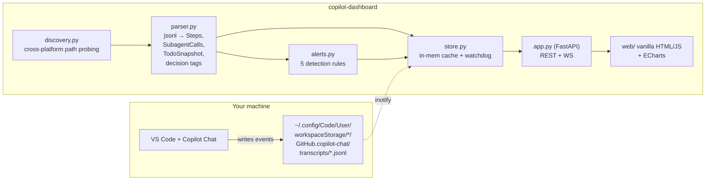

# Copilot Dashboard

> Local, read-only observability UI for **GitHub Copilot Chat (Agent mode)**.
> See what your agent is doing right now, what it just did, and where it got stuck — across every workspace on your machine.

[](#license)
[](#)
[](docker/README.md)



> **Sessions** — live activity strip up top, per-session inline progress, decision-point tags, subagent gantt.

<details>
<summary><strong>More screenshots</strong> — Alerts &amp; Stats</summary>



> **Alerts** — slow tools, stuck calls, repeated failures and long input waits, severity-filterable.



> **Stats** — top tools by call count + average duration, per-workspace.

</details>

---

## Why

Agent-mode Copilot is opaque. Once it spins off a 100-step task with subagents,
terminal commands, tool calls and silent reasoning, it's hard to know:

* Is it still alive, or wedged on a stuck command?
* What did it actually decide along the way?
* Which sessions failed? Which are slow? Which keep retrying the same thing?

This dashboard answers those questions by reading the raw transcript jsonl
files VS Code already writes to disk. Nothing leaves your machine.

## Quickstart

Pick **one** of the three paths.

### A. Local Python (fastest for development)

```bash
git clone https://github.com/Lemonononon/copilot-dashboard.git
cd copilot-dashboard
./run.sh                  # creates .venv on first run
# → http://127.0.0.1:8770
```

### B. Docker (clean, isolated)

```bash
docker build -t copilot-dashboard .
docker run -d --name copilot-dashboard \
  -p 127.0.0.1:8770:8770 \
  -v "$HOME/.config/Code:/data/Code:ro" \
  copilot-dashboard
```

### C. Docker Compose

```bash
docker compose up -d --build
```

Full Docker docs (macOS / Windows mounts, multiple VS Code installs, inotify):
[`docker/README.md`](docker/README.md)

## What you get

| Tab | Highlights |
|---|---|
| **Sessions** | Per-session inline progress, live activity strip at the top, full timeline grouped by turn. Each reasoning block is **NLP-tagged** with decision-point chips (`plan` / `switch` / `issue` / `conclude`…). Subagent dispatches show as a mini-Gantt with click-to-jump. |
| **Alerts**  | Slow tools, stuck pending tools, repeated terminal failures, long user-input waits — surfaced live with a red favicon dot, navigable list, click-to-jump-to-step, and toast notifications for new errors/warnings. |
| **Stats**   | Top tools by call count, average duration (askQuestions excluded), workspace filter. |

Sprinkled throughout: **copy buttons** for session id / user prompt, keyboard
shortcuts (`/` `j` `k` `g` `a` `s` `Esc`), state-aware "Now" card, and a flash
highlight when navigated via an alert link.

## How it works



* **Backend**: FastAPI + uvicorn + watchdog. Single in-memory store, pushed
  over WebSocket on a 2 s tick.
* **Frontend**: vanilla HTML/CSS/JS, ECharts via CDN. No build step.

## REST API

| Method | Path | Purpose |
|---|---|---|
| `GET` | `/api/health` | sanity check (counts) |
| `GET` | `/api/workspaces` | list workspaces (hash + label + folder) |
| `GET` | `/api/sessions?workspace=&limit=` | session summaries (newest first; includes `todo`, `subagents_count`, `activity`) |
| `GET` | `/api/session/{sid}` | full timeline, tool stats, subagent records, todo snapshot |
| `GET` | `/api/activity` | live in-progress sessions snapshot |
| `GET` | `/api/alerts?limit=` | active alerts, sorted by severity then recency |
| `GET` | `/api/stats?workspace=` | aggregated cross-session stats |
| `WS`  | `/ws` | events: `hello`, `session.updated`, `activity.tick` (carries `items[]` + `alerts[]`) |

## Configuration

| Env | Default | What |
|---|---|---|
| `CD_HOST` | `127.0.0.1` | bind host |
| `CD_PORT` | `8770` | bind port |
| `CD_VSCODE_USER_DIR` | _auto-detected_ | path-separator–delimited list of VS Code `User/` dirs (use this for Docker, custom installs, or watching multiple variants) |

## Limitations (deliberately not here)

The following signals are **not present in VS Code's local data** as of
copilot-chat v0.46, so the dashboard cannot show them:

* **Token / request cost.** `debug-logs/<sid>/main.jsonl` currently contains
  only `session_start` spans; usage telemetry is reported server-side.
* **Subagent internal events.** Only the dispatch (description, prompt,
  duration, success) is recorded. Each subagent's own reasoning and tool
  calls are not in the parent transcript.
* **Streaming terminal output mid-call.** `run_in_terminal` writes its result
  once at completion; the dashboard flags stuck/long-running tools but
  cannot show partial stdout.

Hooks for all three exist in `parser.py` / `alerts.py` so they can be wired up
the moment VS Code starts logging them.

## Contributing

PRs welcome. The codebase is intentionally small (~1500 LOC total) and has
zero npm dependencies. To hack on the frontend, just edit `web/*` and
reload — the backend serves it directly.

```bash
# dev mode with auto-reload (backend only)
./run.sh --reload
```

## Disclaimer

This is a third-party tool. 

It only **reads** files VS Code has already written to your local filesystem.
It does **not** send anything over the network, does **not** modify VS Code's
data, and does **not** call the GitHub Copilot API.

If you'd like an extra belt to go with the suspenders, run it inside Docker
with the bind mount marked `:ro` (this is the default in `docker-compose.yml`).

## License

[MIT](LICENSE) © 2026 Lemonononon
